# L4VMX Features

> V2.2.0 2023/04/28
>

L4VMX (LabVIEW for VMX-pi)  

L4VMX makes it possible to program Studica VMX-pi robot with LabVIEW language.  

It is stable and high-end performance.  

It is designed for ease of use, similar to NI myRIO.  

Currently support for LabVIEW 2020 Community.  

## Main Features

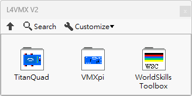

### [VMXpi](https://github.com/L4VMX/L4VMX-LabVIEW)

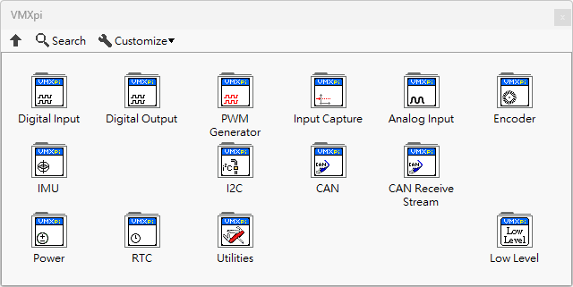

### [TitanQuad](https://github.com/L4VMX/L4VMX-LabVIEW-TitanQuad)

### [WorldSkills Toolbox](https://github.com/L4VMX/L4VMX-LabVIEW-WorldSkills-Toolbox)

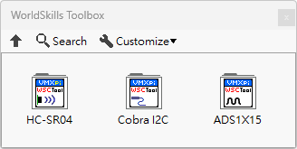

### Supported Core Features

- Digital Input
- Digital Output
- PWM Generator
- Input Capture
- Analog Input
- Encoder
- IMU
- I2C
- CAN Bus
- CAN Bus Receive Stream
- Power
- RTC

### Not Yet Supported Core Features

- UART
- SPI
- LED Array (WS2812)

## VMXpi

### Digital Input

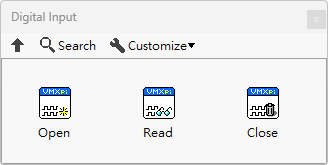

### Digital Output

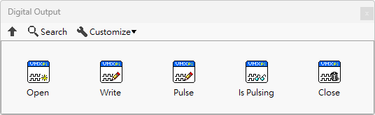

### PWM Generator

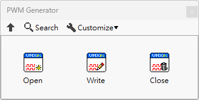

### Input Capture

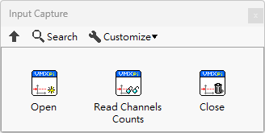

It can be used to capture digital signals such as ultrasonic sensor echo signals or pwm signals.  

### Analog Input

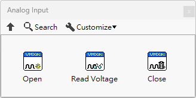

### Encoder

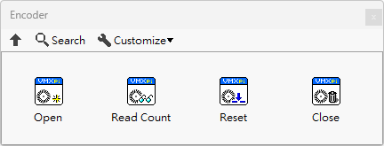

### IMU

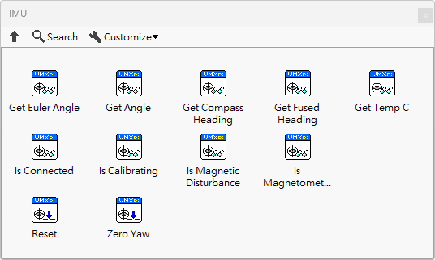

### I2C

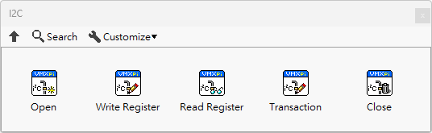

### CAN Bus

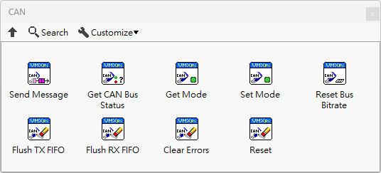

### CAN Bus Receive Stream

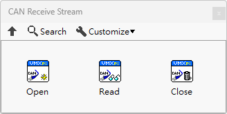

### Power

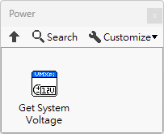

### RTC

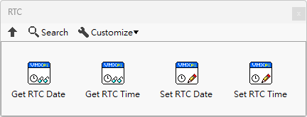

### Utilities

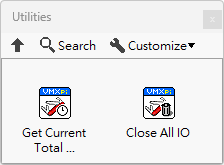

### Low Level / Communication

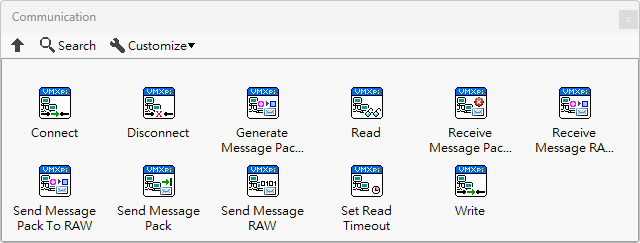

## Studica TitanQuad

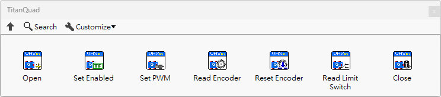

## WorldSkills Toolbox

### HC-SR04

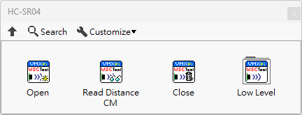

HC-SR04 is a ultrasonic sensor.  

### Studica Cobra I2C

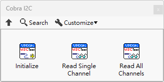

Studica Cobra is a line sensor.  

### ADS1X15

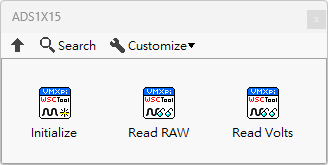

ADS1015/ADS1115 are ADC.

## Easy to Use

### Digital Input Example

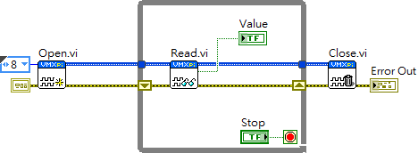

### Encoder Example

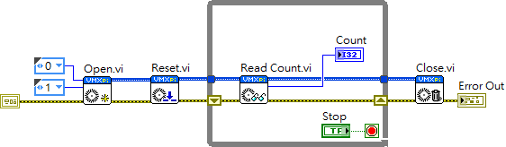

### DC Motor PID Controller

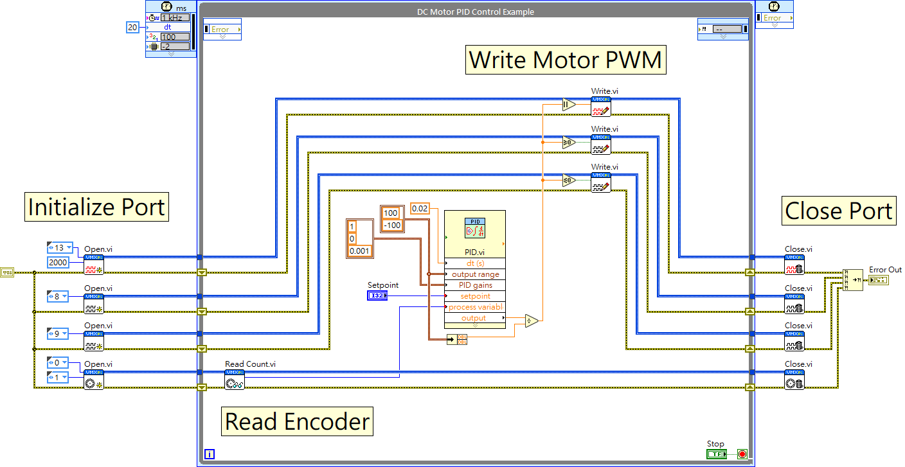

It's really easy to write a motor pid control program.  

### IO Smart Open

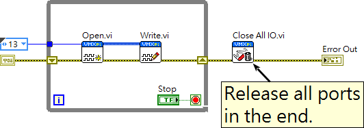

It supports smart open, so you can put IO Open in a loop, and it will automatically initialize the port the first time, without any problem.  

### Read Ultrasonic Sensor Distance

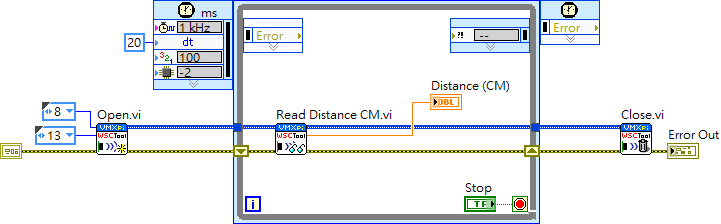

Use WorldSkills Toolbox to read ultrasonic sensors without writing difficult signal processing.  

## Powered By ReMiSYS

Copyright © 2023 ReMiSYS Technology Co., Ltd.
